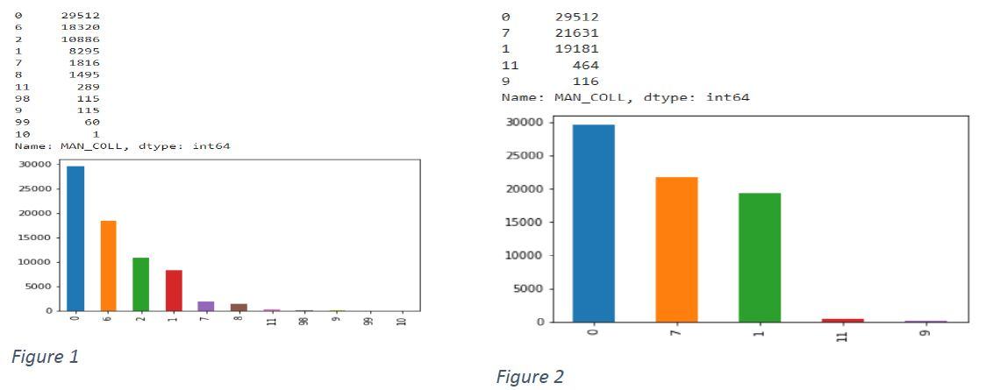
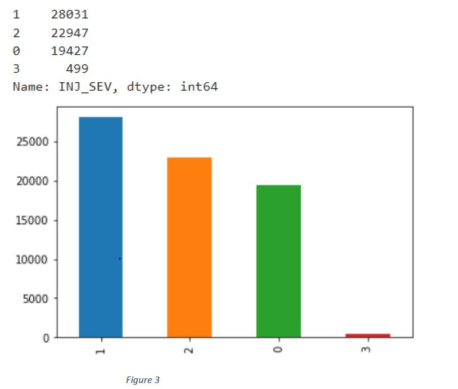
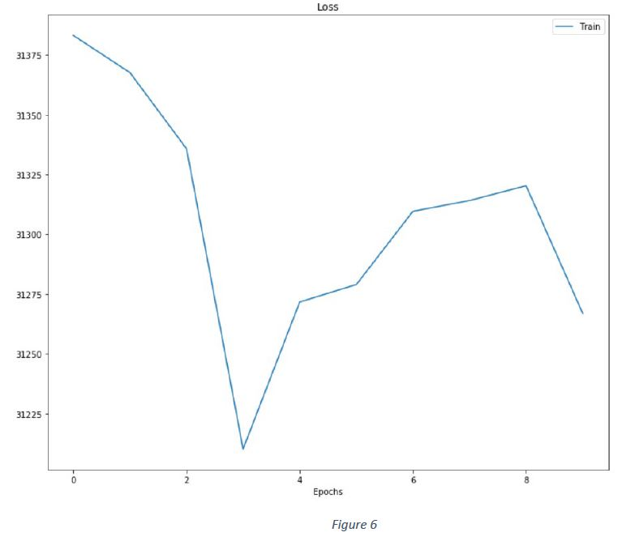
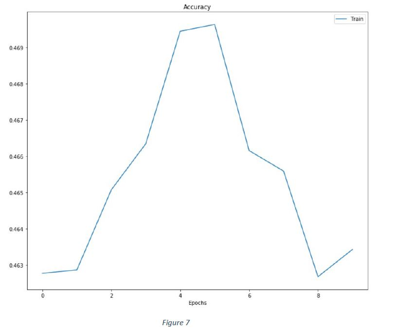
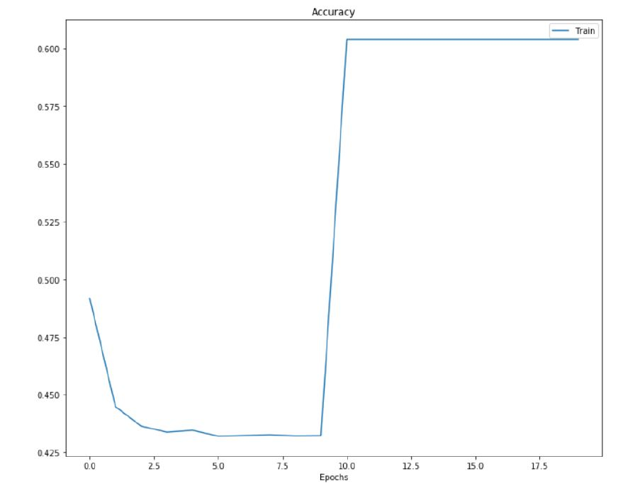

In this project I have applied a feed forward Neural Network to FARS dataset. This is following the implemenatation of the "Abdelwahab, H. T. and Abdel-Aty, M. A. (2001) ‘Development of Artificial Neural Network Models to Predict Driver Injury Severity in Traffic Accidents at Signalized Intersections’. 
The main purpose of this project is to examine the relationship between driver injury severity, driver, vehicle and roadway condition. For this purpose multi-layered feed forward neural network is used.Driver severity injury was divided into four main discrete categories (discussed below in detail) making this model a pattern recognition task.In the below sections we will discuss in detail the dataset used, pre-processing performed, Neural network developed, results obtained and what we can conclude from those results.

<h3>DATASET</h3> 

The dataset used was Fatal Analysis Reporting System (FARS). The data is collected from accidents across the United States from 1975 to 2018 (according to the last update). It has approximately 10 to 100 thousand observations and NHTSA has these datasets stored in their website which is available and accessible to the public. For the purpose of this paper, data of only 2018 was used, which consisted of around 70,000 records. The dataset consisted of large number of attributes, out of which only 8 attributes was selected which were thought to contribute the most for this task. Attributes and their brief description is as followed:

• MAN_COLL: Manner of Collision.

• AGE: Age of the Driver

• SEX: Sex of the driver

• DRUGS: Drugs were involved for this person

• DRUNK_DR: if the driver was drunk or not

• TYP_INT: Type of intersection

• LGT_COND: Light condition at the time of the accident

• CAR_AGE: Age of the car

<h3>Pre-Processing</h3>
The Data that was taken from the FARS couldn’t be taken as it is for the ANN. Following are the pre-processing that was done before passing it to the ANN.
Some of the attributes had values that were similar and didn’t contribute much to the training of the model, thus they were removed. For the Manner of collision originally had 11 classes but it was reduced to 5 classes- unknown, side sweep, rear and front. Fig.1. Shows the distribution of data before and fig.2 shows after.

<h5>Normalization:</h5> The values of the attributes can be on a wide range, when it is passed to a squashing function like Logistic, the output will be large which will result in an exploding grading problem during back-propagation process. To avoid this, normalization is performed on the input data.

<h5>One-hot Encoding:</h5> As the dataset is to classified into four different classes based on the severity of injury. For this purpose a vector of size four was made, where each value represents the prediction probability of each class. The label data is also transformed into a similar type of vector of the same size. The ground truth is set to 1 for that corresponding class.
The distribution of data for Severity for severity of injury is shown in fig. 3

<h3>Neural Network</h3>
The Multilayer perceptron(MLP) Made for this classification consists of three layers- Input Layer, hidden Layer and Output Layer. The MLP was made using only numpy and pandas library in python from scratch and none of the other toolkit(premade MLP) was used.
The connection in MLP was feed forward with backpropagation using stochastic gradient descent. The Number of nodes in the input layer was 4 , hidden layer has 9 nodes and output layer also has 4 nodes. The setting of the value for various hyperparameters of the neural network is discussed in detail below:

Learning Rate:
Learning rate being one of the most important parameter of the Neural Networks that controls the rate at which the model learns. To Select the optimal Learning rate, I trained and evaluated the Neural Network for a range of Learning Rate starting from 0.05 to 0.5 in increments of 0.05. At 0.35 the learning rate became too large and the performance of the system started to oscillate over training epochs.
Till 0.15 the learning rate was too small and the learning rate was getting stuck in the local optimal. The Performance of the system was nearly identical for the 0.20 and 0.25. For this reason , I selected, trained and evaluated the system at the learning rate of 0.225

Bias: The effect of bias on the overall accuracy of the model was tested and found that the model gave better results with bias but the increment was very small and nearly negligent.

Weight: The Value of weight was done in random but made sure that the initial value was in the range of -0.5 to 0.5.

Activation Function: for the purpose of this classification, I used sigmoidal activation function.

Momentum: The value of momentum helps the algorithm reach the value of global minimum faster. For the purpose of this classification the value selected was 0.35.

Neural network operate in two distinct phase: Training and testing. The Dataset for these two phases divided in a ratio 7:3. The Model was then trained on the training data.

<h3>Results</h3>
After the model had been trained, I executed the model on the test data. Figure 5 shows the classification report of the model when executed on the test data. The model gave an accuracy of 46%.
The figure show the graph of TSS vs Epoch iteration graph on the training data. The Epoch on x-axis are in the Quantity of 100, whereas the value on y-axis is the sum of square error(TSS) for the training data.

Figure show the Accuracy vs Epoch graph iteration graph on the training data. The Epoch on x-axis are in the Quantity of 100, whereas the value on y-axis is the accuracy obtained on the training data.

<h3>Assessment</h3>
As can be seen from the results above, the MLP model showed only an overall accuracy of 46%. This can be attributed to the multi-class classification problem that I tried to do. Also the data is highly unbalanced and the problem domain has high complexity.
Reducing the multi-class problem to binary problem will give better results. Such conversion significantly reduces the model building time while increasing prediction accuracy of the model.
To Prove this I have modified the severity of injury by removing the records with ‘unknown’ label and joining the ‘injured’ and ‘fatal injury’. Making the classification as binary classification. The graph comparison of the before and after of the conversion is shown in figure 8 and figure 9.
After this I again trained the model with the same hyperparameters and validated its prediction on the test data set.

The Accuracy of the model jumped from 45% to 60% when this was done. The accuracy graph in figure 10 shows the jump.

